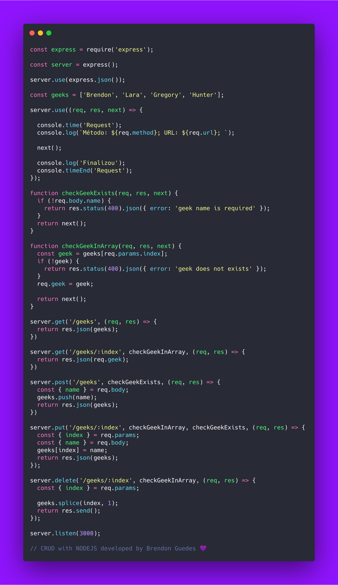

# CRUD COM NODEJS PARA GEEKHUNTER

Este código contém comentários, para verificar uma versão sem comentários [clique aqui](https://gist.github.com/brendonguedes/a80a11dc7979bbc8fbece728976de0f0)

Além disso, você também pode baixar o arquivo do Insomnia que usei para testar as rotas, faça o download [clicando aqui](https://blog.geekhunter.com.br/criar-crud-nodejs#Agora_vamos_criar_o_CRUD)

Confira o artigo completo  [clique aqui](https://blog.geekhunter.com.br/criar-crud-nodejs#Agora_vamos_criar_o_CRUD)

  
  
                                                                                          
   
     

                                                                                      
                                                                                      

